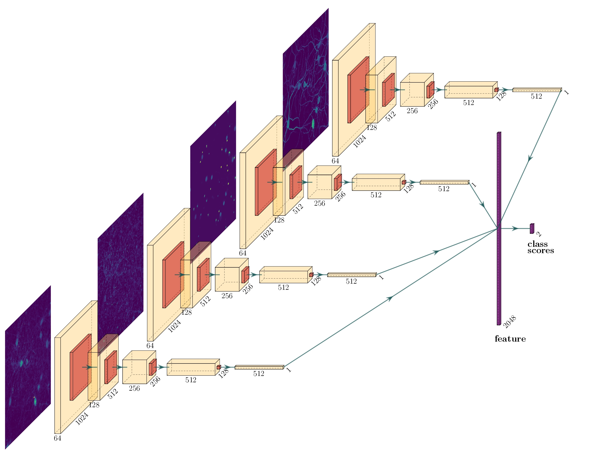

# Neuron-Image-Classification

In this work, we aim to build an end-to-end pipeline to estimate treatment effects of Amyloid-β compound in neuronal cells. The pipeline can be further applied to biomedical research to efficiently identify new compounds that protect cells against the treatment of Amyloid-β with potential to discover new drugs for the Alzheimer’s disease. This is a binary classification task where we aim to classify whether neurons are treated with Amyloid-β or not.

Previous work by [William Stone](https://github.com/wfbstone/Neuron-Image-Classification) has shown the potential of CNN-based classifiers on this task. He implemented a VGG19 model and achieved 97.2% test accuracy. His training and testing neuron images were taken after staining with the Cy5 dye, a biomarker for the MAP2 gene found in the Neuronal Cytoskeleton. 

One of the models we implemented:

